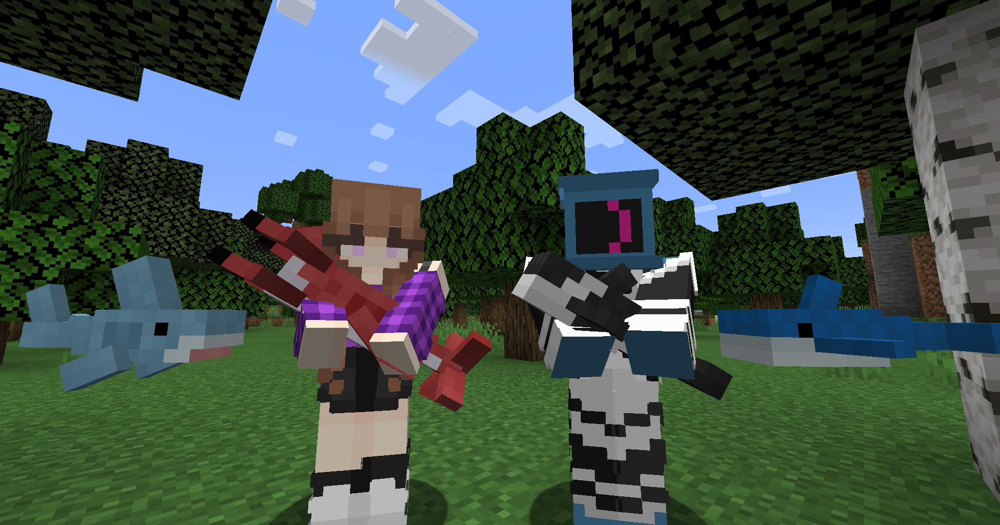

# Blåhaj Restitched

A Minecraft mod that adds toys and plushies, most notably the IKEA BLÅHAJ!

Continuation of the original Blåhaj mod by [hibiii](https://github.com/hibiii) for Forge!

All plushies are craftable using yarn, which you get from turning wool -> yarn in the Yarn Spinner block!

## Contact
* Email - vivian@dogatorix.com
* Discord - @dogatorix

## Credits
- [hibiii](https://github.com/hibiii) - Original Blåhaj Mod
- [agnor99](https://github.com/agnor99) - Original Forge Port
